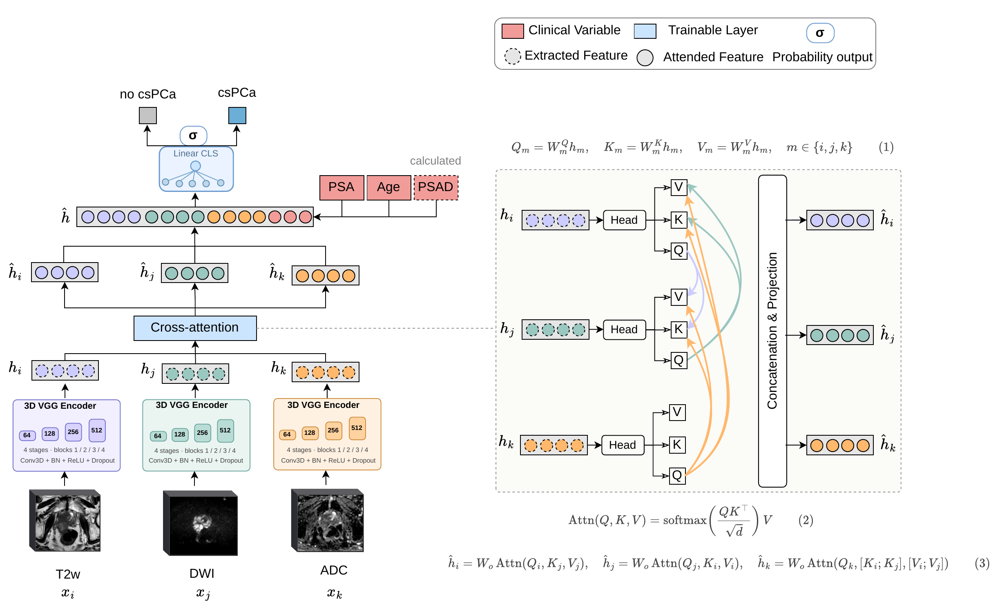

# Cross-Attention Fusion of Biparametric MRI Sequences and Clinical Variables for Patient-Level csPCa Classification

The model classifies clinically significant prostate cancer (csPCa) from biparametric MRI (bpMRI) — T2-weighted (T2W) and diffusion-weighted imaging, represented by the DWI high-b-value volume and the derived apparent diffusion coefficient (ADC) map — together with three clinical variables (age, PSA, PSA density). Each sequence is processed by its own 3D VGG encoder; sequence features are fused by a cross-attention block and concatenated with the clinical variables before a linear classifier produces the csPCa probability.



## Repository layout

```
.
├── README.md
├── requirements.txt
├── figures/
│   └── architecture.png
└── src/
    ├── utils.py              # seeding, tensor resizing
    ├── losses.py             # focal BCE, class-weight helper, L1 regularizer
    ├── train.py              # training & validation loop
    ├── models/
    │   ├── layers.py         # conv / norm / activation factories, pooling
    │   ├── encoder.py        # 3D VGG encoder
    │   ├── attention.py      # three-stream cross-attention
    │   ├── heads.py          # classification head
    │   └── model.py          # full multimodal model
    └── data/
        ├── alignment.py      # patient-id extraction & cross-sequence alignment
        └── dataset.py        # dataset class and consistent augmentations
```

## Installation

```bash
git clone <this-repo>
cd <this-repo>
python -m venv .venv && source .venv/bin/activate
pip install -r requirements.txt
```

## Data layout

The training script expects the following directory structure; each subfolder holds one file per patient.

```
<data-root>/
├── t2w/{train,val,test}/PCa-XXXX_*.nii.gz
├── dwi/{train,val,test}/PCa-XXXX_*.nii.gz
├── adc/{train,val,test}/PCa-XXXX_*.nii.gz
└── clinical_variables_v2/{train,val,test}/PCa-XXXX_*.npy
```

Volumes are expected at shape `(D=32, H=224, W=224)` and are min–max normalized per volume inside the dataset. Clinical `.npy` files are 1D arrays of length 3 (age, PSA, PSA density).

Labels are supplied via CSV files with columns `patient_id` and `label_ISUP` (binary csPCa label).

## Training

```bash
python -m src.train \
    --data-root /path/to/data \
    --labels-train /path/to/train.csv \
    --labels-val   /path/to/val.csv \
    --out-dir      ./runs/exp1 \
    --device cuda:0 \
    --batch-size 2 --epochs 800 \
    --lr 3e-5 --weight-decay 1e-5 \
    --l1-lambda 1e-5 --focal-gamma 2.0 \
    --w-neg 1.755 --w-pos 0.699
```

The model that achieves the best validation AUC is saved as `best_val_auc.pt` in `--out-dir`.

### Loss

The default objective is binary cross-entropy with an optional focal modulating factor and per-class weights:

```
L = mean_b [ (1 - p_t)^γ · BCE(logit_b, y_b) · w_{y_b} ]   +   λ · ||θ||_1
```

The configuration used in the paper is `gamma = 2` with class-balanced weights `[1.755, 0.699]`. Plain BCE is recovered with `gamma = 0` and `class_weights = [1.0, 1.0]`. Balanced class weights can also be computed from the training label distribution via `src.losses.compute_class_weights`.

### Cross-attention — note on the asymmetric design

The cross-attention module in `src/models/attention.py` uses an **asymmetric** context selection (see the docstring of `CrossAttention`): T2W attends to DWI, DWI attends to T2W, and ADC attends to both T2W and DWI. This matches the configuration that produced the best validation performance reported in the paper. The `range(2)` inside the attention loop is intentional — do not change it to `range(3)` without re-running the validation protocol.

## Citation

The accompanying paper is currently under review.

## License

This project is released under the MIT License — see [LICENSE](LICENSE) for details.
